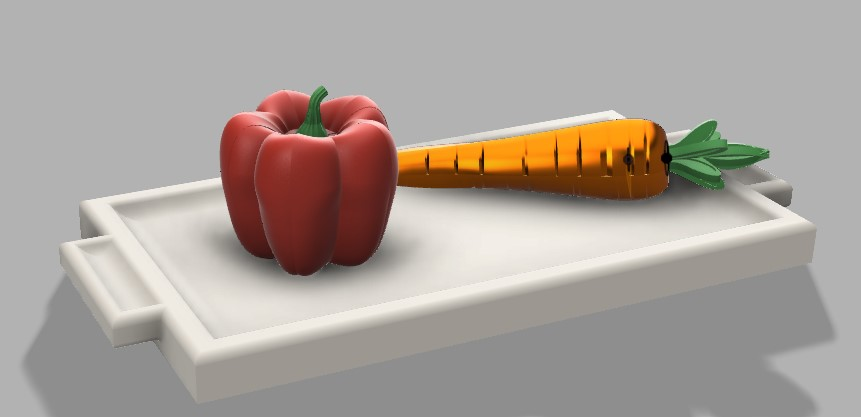

# 3D files for Kitchen Objects
In this repository there are different kitchen objects designed to be part of a robotic manipulation set. The models are authoral and free for use and distribution. You can have the stl file of the whole object or the 3d-printing ready parts that contribute for a smoother print without the need for supports.

